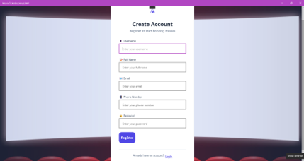
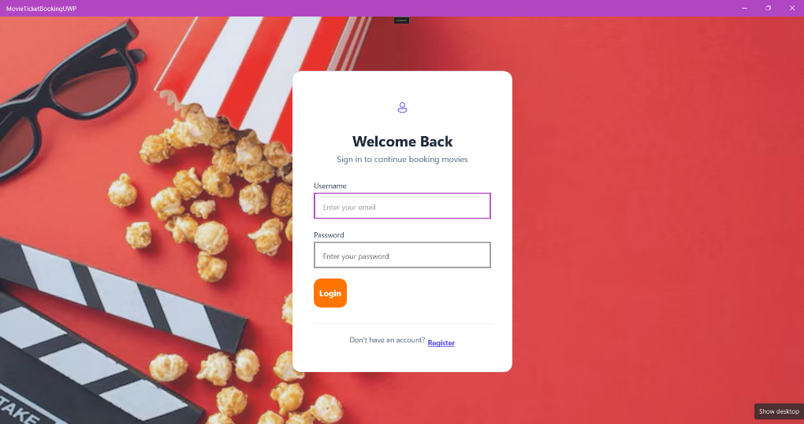
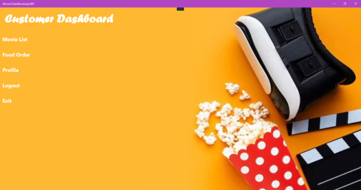
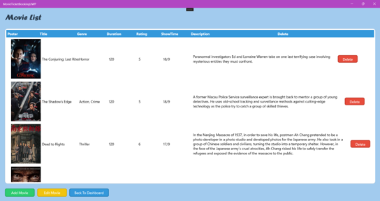
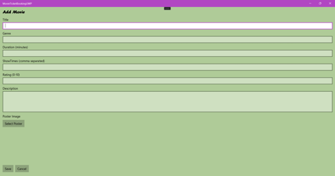
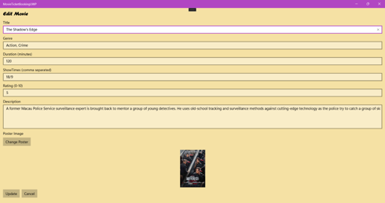
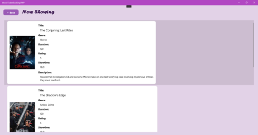

# 🎬 Movie Ticket Booking System

A desktop-based Movie Ticket Booking System developed as a university group project using **C#**, **Universal Windows Platform (UWP)**, **ASP.NET Core Web API**, **Entity Framework Core**, and **Microsoft SQL Server**.

The system allows customers to browse movies, book tickets, purchase food and drinks, while providing administrators with complete management features for movies, venues, showtimes, seats, and menu items.

---

# 📖 Project Overview

The Movie Ticket Booking System (MTBS) was developed to modernize the traditional cinema ticket purchasing process by replacing manual operations with a digital platform.

The system supports secure user authentication, movie management, venue and seat management, food ordering, and customer booking. It also provides role-based access control, allowing administrators to manage the entire cinema system while customers can conveniently browse movies and place orders.

---

# ✨ Features

## User Module

- User Registration
- User Login
- Role-based Authentication
- Profile Management
- Admin Dashboard
- Customer Dashboard

## Movie Management

- View Movie List
- Add Movie
- Edit Movie
- Delete Movie
- Customer Movie Listing

## Venue & Seat Management

- Manage Cinema Venues
- Add Seats
- Edit Seat Information
- Remove Seats
- Showtime Scheduling
- Seat Pricing
- Seat Validation

## Food & Drink Management

- Add Menu Items
- Update Menu Items
- Delete Menu Items
- Customer Food Ordering
- Shopping Cart
- Checkout

---

# 🛠 Technologies Used

- C#
- Universal Windows Platform (UWP)
- ASP.NET Core Web API
- Entity Framework Core
- Microsoft SQL Server
- XAML
- REST API
- Visual Studio 2022

---

# 📂 Project Structure

```
Movie-Ticket-Booking-System/

│
├── MovieTicketBooking/          # UWP Client
├── MovieTicketBookingAPI/       # ASP.NET Core Web API
├── Database/
│     └── database.sql
│
├── screenshots/
│
├── Report.pdf
│
├── README.md
├── LICENSE
└── .gitignore
```

---

# 🚀 How to Run

## Requirements

- Visual Studio 2022
- .NET SDK
- SQL Server
- Entity Framework Core

## Installation

1. Clone this repository

```bash
git clone https://github.com/chiakexin1/movie-ticket-booking-system.git
```

2. Restore NuGet packages

3. Configure SQL Server connection string

4. Run the ASP.NET Core Web API

5. Start the UWP application

---

# 📸 Screenshots

## User Registration



---

## User Login



---

## Admin Dashboard


---

## Customer Dashboard



---

## Movie Management



---

## Add Movie



---

## Edit Movie



---

## Customer Movie List



---

# 📄 Documentation

A complete project report containing the system design, literature review, UML diagrams, implementation details, evaluation, and testing screenshots is included in:

**📄 Report.pdf**

---

# 👨‍💻 My Contribution

My primary responsibility in this project was the **Movie Management Module**, including:

- Display Movie List
- Add New Movies
- Edit Movie Information
- Delete Movies
- Customer Movie Listing
- Integration with ASP.NET Core Web API
- Database CRUD Operations
- UI Development using UWP

---

# 🎯 Learning Outcomes

Throughout this project, I gained practical experience in:

- Desktop application development using UWP
- RESTful API development
- Entity Framework Core
- SQL Server database design
- CRUD operations
- Role-based authentication
- Client-server architecture
- Team collaboration
- Software testing and debugging

---

# 📚 References

This project was developed for educational purposes as part of the **Rapid Application Development (UCCB1223)** course at Universiti Tunku Abdul Rahman (UTAR).

---

# 📜 License

This project is intended for educational purposes only.
